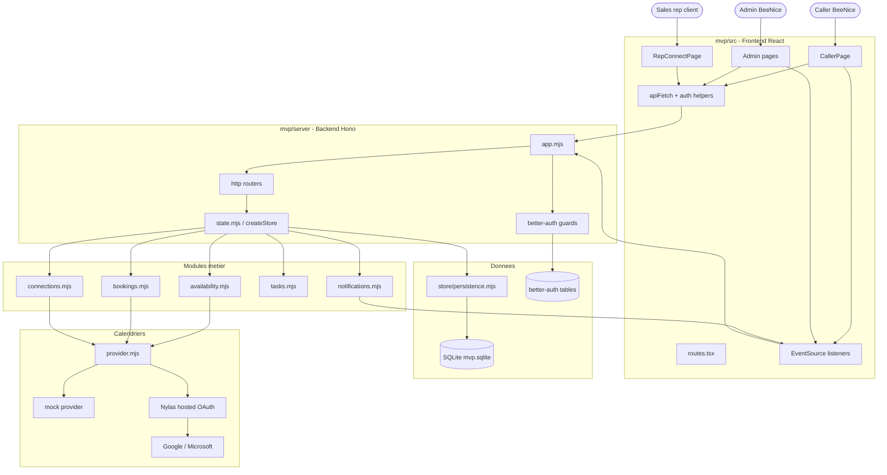
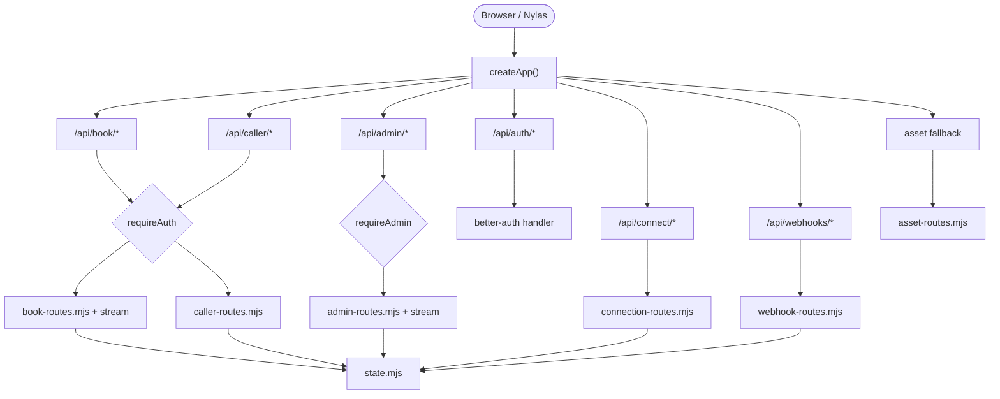
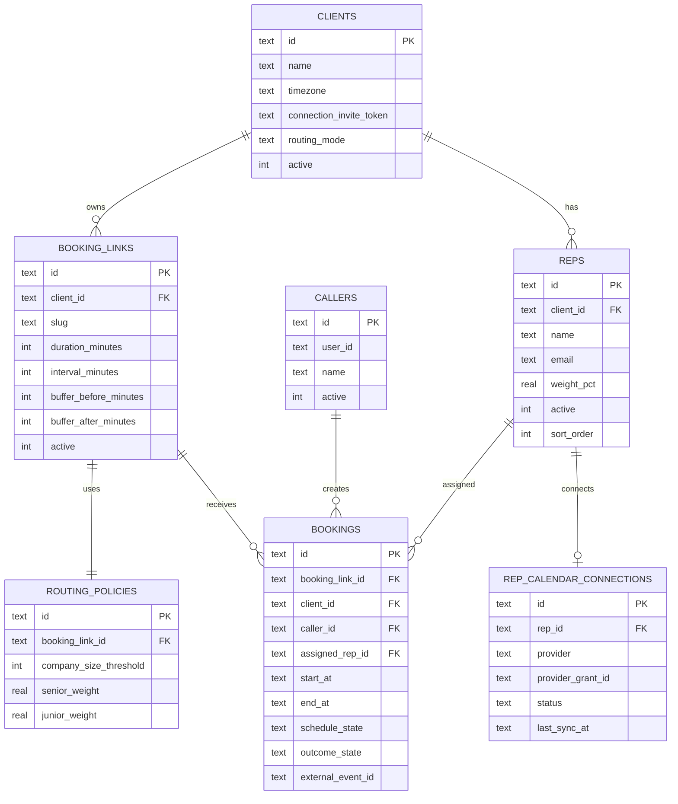
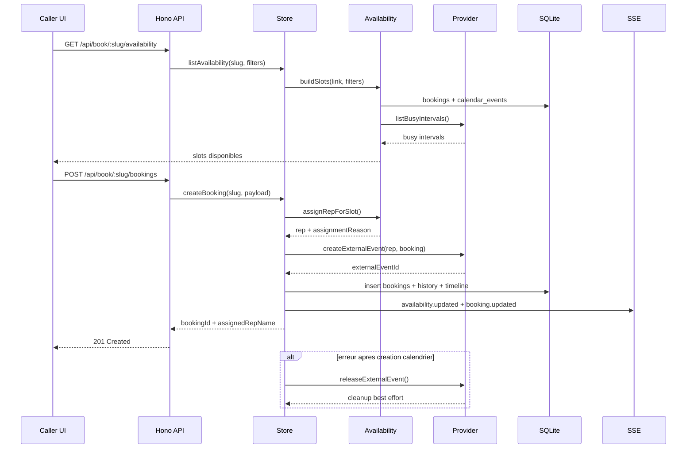
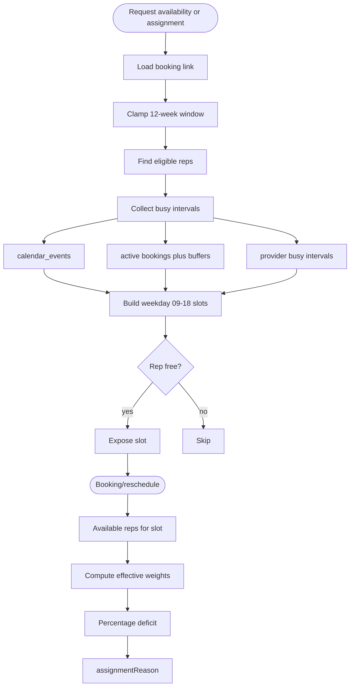
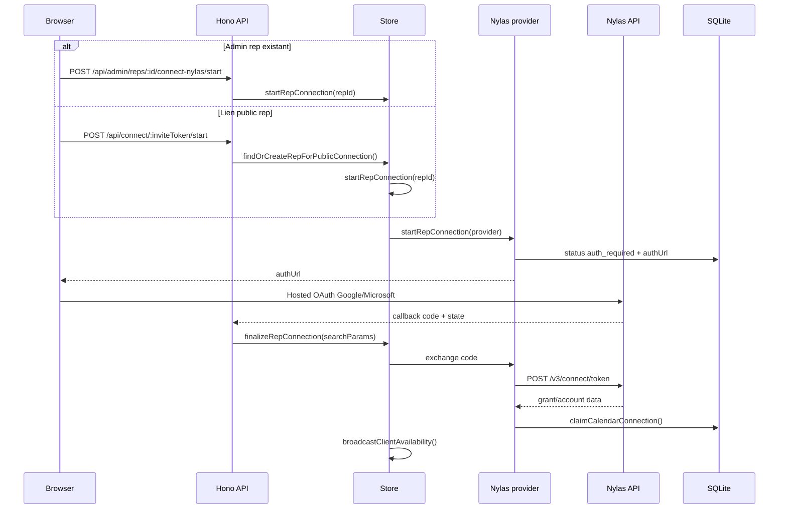
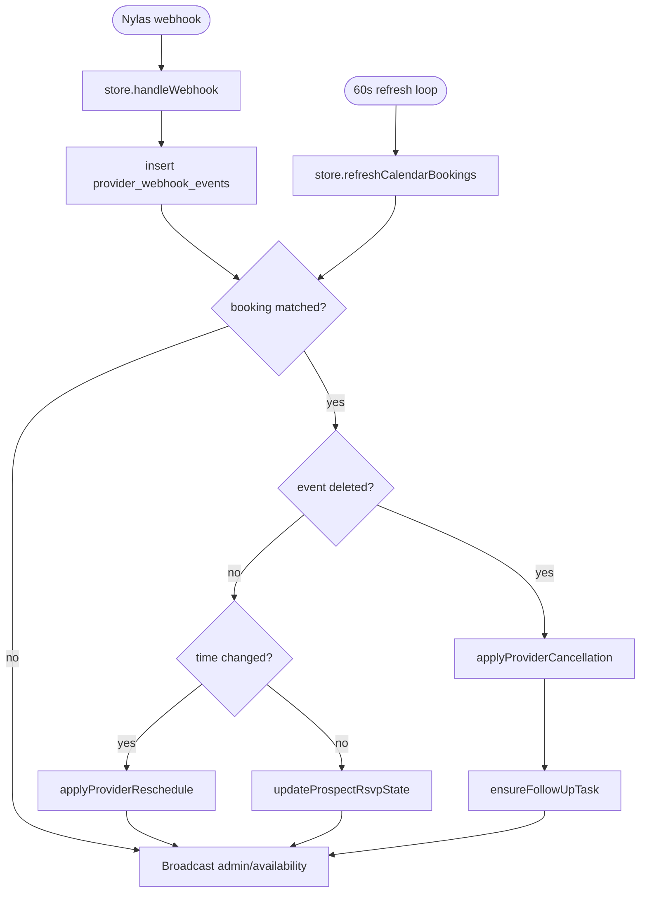
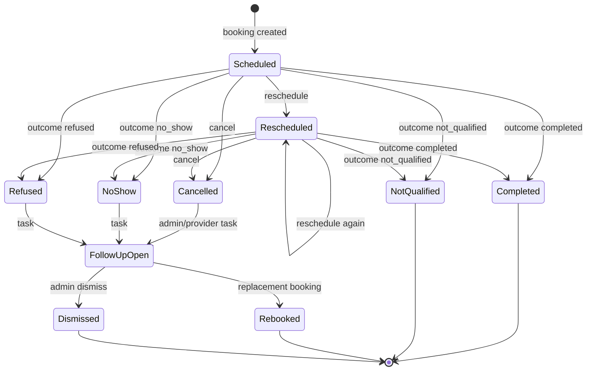

# Architecture Technique — BeeNice Calendar

> Reference pour les agents qui doivent naviguer dans le codebase ou comprendre les flux de donnees.
> Repo : `aramz33/BeeNice-Calendar` — runnable product dans `mvp/`.

**Liens rapides :** [[TODO]] · [[LOG]] · [[overview]] · [[functional-spec]] · [[routing-design]] · [[microsoft-enterprise-auth]]

---

## Resume operatoire

BeeNice Calendar est un outil B2B de booking : les callers BeeNice placent des rendez-vous de decouverte dans les calendriers des sales reps d'un client. Le MVP actuel est une app full-stack locale sous `mvp/` : React cote frontend, Hono cote backend, SQLite pour la persistance, Nylas comme provider calendrier reel.

| Couche | Choix actuel | Fichiers d'entree |
|---|---|---|
| Frontend | React 18 · React Router 7 · Tailwind 4 · Radix · Vite | `mvp/src/main.tsx`, `mvp/src/routes.tsx` |
| Backend HTTP | Hono servi par `@hono/node-server` | `mvp/server/index.mjs`, `mvp/server/app.mjs` |
| Auth | `better-auth`, sessions cookies, roles `admin` / `caller` | `mvp/server/lib/auth.mjs`, `mvp/src/lib/auth.ts` |
| Orchestration | `createStore()` facade toutes operations metier | `mvp/server/lib/state.mjs` |
| Persistance | SQLite `better-sqlite3` + migrations maison | `mvp/server/lib/database.mjs`, `store/persistence.mjs` |
| Calendrier | provider `mock` local ou `nylas` reel | `mvp/server/lib/provider.mjs` |
| Temps reel | SSE pour invalidation slots/admin | `mvp/server/lib/http/streams.mjs`, `notifications.mjs` |

> Point de vigilance : certaines notes plus anciennes parlent encore d'un serveur Node HTTP brut. Le repo courant utilise bien Hono.

---

## Vue d'ensemble hybride

Le graphe donne la carte mentale ; le tableau qui suit donne les chemins exacts.



### Arborescence utile

```text
mvp/
├── src/                         Frontend React
│   ├── routes.tsx               Routes / guards / redirections
│   ├── lib/                     apiFetch, auth, session, types, time
│   ├── components/              UI partagee MVP
│   └── pages/                   Login, caller, admin, rep connect
└── server/                      Backend Hono + SQLite
    ├── index.mjs                create provider/store/auth, serve Hono, refresh loop
    ├── app.mjs                  middlewares, guards, route mounts, asset fallback
    └── lib/
        ├── http/                routers Hono + SSE + assets + body parsing
        ├── state.mjs            facade store, orchestration metier
        ├── availability.mjs     slots, busy intervals, routing/assignment
        ├── bookings.mjs         creation, outcome, schedule, cancel
        ├── connections.mjs      rep connections, public invite, conflict ownership
        ├── provider.mjs         mock vs Nylas provider
        ├── tasks.mjs            reposition_booking tasks
        ├── notifications.mjs    SSE registry/broadcasts
        ├── database.mjs         schema, migrations, seed, normalization
        └── store/               persistence + vues lecture admin/public
```

---

## Frontend et surfaces utilisateur

| Route UI | Guard | Page / controller | Role |
|---|---|---|---|
| `/login` | public | `LoginPage.tsx` + `lib/auth.ts` | login admin/caller |
| `/` | session | `RootRedirect.tsx` | redirige selon role/session |
| `/caller` | `RequireAuth` | `CallerPage.tsx` + `caller/useCallerController.ts` | espace caller unifie |
| `/book/:slug` | `RequireAuth` | redirect vers `/caller?workspace=:slug` | compat ancien lien |
| `/admin/bookings` | `RequireAdmin` | `AdminBookingsPage.tsx` + controller | console bookings/admin agenda |
| `/admin/settings` | `RequireAdmin` | `AdminSettingsPage.tsx` | clients + callers |
| `/admin/settings/connections` | `RequireAdmin` | `AdminConnectionsPage.tsx` | connexions reps |
| `/connect/:inviteToken` | public | `RepConnectPage.tsx` | connexion calendrier rep |

Tous les appels frontend passent par `/api/*` sur la meme origine logique. En dev, Vite proxifie vers l'API ; en staging/prod local, Hono peut servir `mvp/dist`.

---

## Backend HTTP et routes API

`app.mjs` applique les middlewares CORS/auth puis monte les routeurs. Les routes `/api/book/*` et `/api/caller/*` sont protegees caller/admin ; les routes `/api/admin/*` exigent le role admin ; `/api/connect/*` reste public pour les liens d'invitation reps.



### Route map compact

| Famille | Guard | Module | Operations principales |
|---|---|---|---|
| `/api/auth/*` | public + trusted origins | `better-auth` | session, sign-in, sign-out |
| `GET /api/caller/workspaces`, `GET /api/caller/tasks` | `requireAuth` | `caller-routes.mjs` | workspaces et taches du caller connecte |
| `/api/book/:slug/availability`, `/api/book/:slug/bookings*` | `requireAuth` | `book-routes.mjs` | availability, bookings caller, create/cancel booking |
| `/api/book/:slug/stream` | `requireAuth` | `streams.mjs` | SSE `availability.updated` |
| `/api/admin/bookings*` | `requireAdmin` | `admin-routes.mjs` | liste, detail, availability reschedule, outcome, schedule |
| `/api/admin/calendar` | `requireAdmin` | `admin-routes.mjs` | vue agenda filtree |
| `/api/admin/tasks`, `PATCH /api/admin/tasks/:id` | `requireAdmin` | `admin-routes.mjs` | taches repositionnement |
| `/api/admin/settings*` | `requireAdmin` | `admin-routes.mjs` | clients + callers |
| `/api/admin/reps*` | `requireAdmin` | `admin-routes.mjs` | reps + start connection Nylas |
| `/api/admin/stream` | `requireAdmin` | `streams.mjs` | SSE admin : booking/task/connection/settings |
| `/api/connect/:inviteToken` | public | `connection-routes.mjs` | formulaire public rep + start OAuth |
| `/api/webhooks/nylas` | public provider endpoint | `webhook-routes.mjs` | challenge + webhook Nylas |

---

## Store et modules metier

Le backend n'est pas organise en services long-running separes. `state.mjs` construit une facade qui assemble le provider, les requetes SQL, les modules metier et les broadcasts SSE.

| Module | Responsabilite | Point de vigilance |
|---|---|---|
| `state.mjs` | facade store, transactions, broadcasts, refresh calendrier | eviter d'y rajouter du comportement UI ; garder les invariants metier |
| `availability.mjs` | slots, busy intervals, eligible reps, assignment | doit rester coherent entre affichage slots, booking, reschedule |
| `bookings.mjs` | create booking, outcome, schedule, cancel caller | ecrit historique + timeline ; provider calendar-first |
| `connections.mjs` | Nylas start/finalize, invite public, ownership conflicts | une connexion provider ne doit appartenir qu'a un rep |
| `tasks.mjs` | `reposition_booking` open/done/dismissed | source booking + replacement booking |
| `notifications.mjs` | clients SSE par workspace + admin SSE | broadcasts apres mutations |
| `store/*.mjs` | persistance et vues lecture | eviter de dupliquer la logique metier dans les vues |

---

## Persistance SQLite

Le schema est cree/migre dans `database.mjs`. Les tables sont volontairement simples : l'historique est append-only, l'etat courant reste sur `bookings`.

### Tables coeur

| Table | Role | Relations importantes |
|---|---|---|
| `clients` | client BeeNice, timezone, token public rep, mode routing, contact commercial (`primary_contact_first_name/last_name/phone/email`) | 1 client -> n reps, n booking_links |
| `callers` | utilisateurs BeeNice operationnels | lie aux bookings et aux tasks |
| `booking_links` | workspace de booking par client | porte duration, interval, buffers 15/15, min notice |
| `reps` | commerciaux client eligibles au routing | `weight_pct` null = flexible, valeur = % epingle admin |
| `rep_calendar_connections` | etat provider d'un rep | `rep_id` unique, grant/account Nylas uniques si presents |
| `routing_policies` | legacy senior/junior par booking link | conserve pour compat schema, ignore par le routing % |
| `bookings` | RDV courant + etat sync + assignation | lie client, caller, rep, booking link |



### Tables audit, sync et operations

| Table | Role | Note |
|---|---|---|
| `booking_status_history` | historique immutable from/to display status | conserve l'audit des changements |
| `booking_timeline_events` | timeline lisible UI admin | `booking_created`, `schedule_set`, `outcome_set`, `task_created`, etc. |
| `follow_up_tasks` | taches de repositionnement | creees sur no-show, refus, annulation admin/provider |
| `calendar_events` | busy cache local par rep | source complementaire a Nylas |
| `provider_webhook_events` | journal brut webhooks provider | utile pour debug sync |

### Routing % par rep

Etat branche `feat/routing-percentage-clean` (`df24f53`, pas encore merge) : le routing se fait par pourcentage par rep. `reps.weight_pct REAL NULL` est la seule persistance utile : `NULL` = flexible, une valeur = % epingle par l'admin. Les % effectifs sont calcules en live : les reps epingles gardent leur valeur, les flexibles se partagent le reste. `routing_policies` et `clients.routing_mode` restent dans le schema pour compat SQLite mais ne pilotent plus l'assignation. Voir [[routing-design]].

---

## Flux 1 — Prise de RDV

Invariant : le slot affiche et le booking final passent par les memes regles d'availability. Au moment de creer un booking, le backend re-verifie le slot, assigne un rep disponible, cree l'evenement calendrier, puis persiste le booking.



---

## Flux 2 — Availability et routing

Sources d'indisponibilite : bookings actifs avec buffers, `calendar_events` locaux, et provider busy intervals si le mode Nylas est actif et la connexion rep est utilisable.



---

## Flux 3 — Connexion calendrier Nylas

Deux entrees convergent vers le meme provider : l'admin peut lancer une connexion pour un rep existant, ou un sales rep peut passer par un lien public `/connect/:inviteToken`.

| Etape | Admin | Rep public |
|---|---|---|
| Point d'entree | `/admin/settings/connections` | `/connect/:inviteToken` |
| API start | `POST /api/admin/reps/:id/connect-nylas/start` | `POST /api/connect/:inviteToken/start` |
| Creation rep | rep existe deja | `findOrCreateRepForPublicConnection` |
| OAuth | Nylas Hosted OAuth | Nylas Hosted OAuth |
| Callback | `/api/admin/integrations/nylas/callback` | meme callback, page terminale publique (`source:public_invite` → mode `public_terminal`) |

> Ce callback est sous `/api/admin/*` mais **exempte de `requireAdmin`** dans `app.mjs` (le rep public n'est pas authentifie ; le handler valide via le `code` Nylas + le `state`). Sans cette exemption le flux public renvoyait `{"error":"Unauthorized"}` (corrige PR #7).
| Effet final | connexion rep claim + broadcasts | idem |



---

## Flux 4 — Webhooks, refresh et reconciliation calendrier

Les changements calendrier peuvent venir du webhook Nylas ou du refresh periodique toutes les 60 secondes dans `index.mjs`. Les deux chemins finissent par mettre a jour le booking et broadcaster les invalidations.



---

## Statuts booking et taches de repositionnement

Le booking a deux axes : `schedule_state` pour le calendrier, `outcome_state` pour le resultat commercial. `getDisplayStatus()` derive le statut affiche.

| Display status  | Axe source | Tache repositionnement          | Sens                         |
| --------------- | ---------- | ------------------------------- | ---------------------------- |
| `scheduled`     | schedule   | non                             | RDV prevu, pas encore traite |
| `rescheduled`   | schedule   | non                             | RDV deplace                  |
| `cancelled`     | schedule   | oui selon chemin admin/provider | RDV annule                   |
| `completed`     | outcome    | non                             | Honore                       |
| `no_show`       | outcome    | oui                             | Prospect absent              |
| `not_qualified` | outcome    | non                             | Non qualifie (terminal)      |
| `refused`       | outcome    | oui                             | Pas dispo a ce creneau       |



Contrat detaille : voir `docs/status-contract.md` dans le repo.

---

## Provider calendrier

| Mode | Activation | Comportement |
|---|---|---|
| `mock` | defaut local, `MVP_CALENDAR_PROVIDER=mock` | connexions simulees, pas d'OAuth reel, events mock |
| `nylas` | `MVP_CALENDAR_PROVIDER=nylas` + env Nylas | Hosted OAuth, events reels Google/Microsoft, busy intervals provider, webhooks |

Variables principales : `MVP_NYLAS_API_KEY`, `MVP_NYLAS_CLIENT_ID`, `MVP_NYLAS_CALLBACK_URL`, `MVP_NYLAS_API_URI`.

Callback local actuel : `http://localhost:8787/api/admin/integrations/nylas/callback`.

---

## Commandes et runtime

| Commande | Usage |
|---|---|
| `npm run dev` | API + web Vite en parallele |
| `npm run dev:api` | API Hono seule, defaut `http://localhost:8787` |
| `npm run dev:web` | Vite seul, defaut `http://localhost:5174` |
| `npm run build` | build frontend vers `mvp/dist` |
| `npm run start` | sert API + build Vite depuis le serveur Hono |
| `npm run test:web` | tests frontend Vitest |
| `node --test mvp/server/lib/**/*.test.mjs mvp/server/lib/*.test.mjs mvp/server/lib/http/*.test.mjs` | suite backend |

Env utiles : `MVP_API_PORT`, `MVP_WEB_PORT`, `MVP_DB_PATH`, `MVP_CALENDAR_PROVIDER`, `BETTER_AUTH_SECRET`, `BETTER_AUTH_URL`.

---

## Carte des fichiers source

| Besoin | Lire d'abord |
|---|---|
| Comprendre le boot runtime | `mvp/server/index.mjs`, `mvp/server/app.mjs` |
| Ajouter/modifier une route API | `mvp/server/lib/http/*.mjs`, puis `state.mjs` |
| Toucher booking/cancel/reschedule/outcome | `mvp/server/lib/bookings.mjs` + tests booking/state |
| Toucher availability/routing | `mvp/server/lib/availability.mjs` + `routing-design` |
| Toucher connexion Google/Microsoft | `connections.mjs`, `provider.mjs`, `admin-routes.mjs` |
| Toucher caller UI | `mvp/src/pages/CallerPage.tsx` + `caller/useCallerController.ts` |
| Toucher admin bookings | `AdminBookingsPage.tsx` + `admin-bookings/useAdminBookingsController.ts` |
| Toucher schema/persistence | `database.mjs` + `store/persistence.mjs` |
| Toucher auth | `auth.mjs`, `seed-users.mjs`, `mvp/src/lib/auth.ts` |

---

## Regles de modification

- Garder le comportement MVP dans `mvp/`.
- Les appels frontend passent par `mvp/src/lib/api.ts` ou `mvp/src/lib/auth.ts`.
- Ne pas modifier `mvp/server/data/mvp.sqlite` comme source de verite ; changer seed/schema/state.
- Quand on touche booking, availability, routing, provider calendrier ou status history, ajouter une couverture ciblee.
- `company_size` est volontairement cache du template par defaut ; ne pas le reexposer sans instruction explicite.

---

<!-- derniere maj: 2026-06-24 -->
